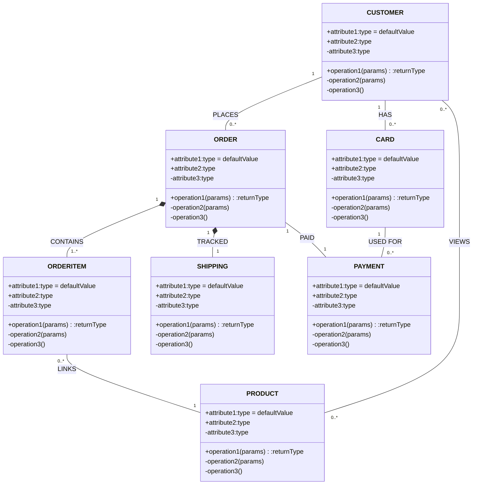

# UML Class Diagram - Order Management System

```mermaid
classDiagram
    class CUSTOMER {
        +attribute1:type = defaultValue
        +attribute2:type
        -attribute3:type
        +operation1(params):returnType
        -operation2(params)
        -operation3()
    }
    class ORDER {
        +attribute1:type = defaultValue
        +attribute2:type
        -attribute3:type
        +operation1(params):returnType
        -operation2(params)
        -operation3()
    }
    class ORDERITEM {
        +attribute1:type = defaultValue
        +attribute2:type
        -attribute3:type
        +operation1(params):returnType
        -operation2(params)
        -operation3()
    }
    class PRODUCT {
        +attribute1:type = defaultValue
        +attribute2:type
        -attribute3:type
        +operation1(params):returnType
        -operation2(params)
        -operation3()
    }
    class SHIPPING {
        +attribute1:type = defaultValue
        +attribute2:type
        -attribute3:type
        +operation1(params):returnType
        -operation2(params)
        -operation3()
    }
    class CARD {
        +attribute1:type = defaultValue
        +attribute2:type
        -attribute3:type
        +operation1(params):returnType
        -operation2(params)
        -operation3()
    }
    class PAYMENT {
        +attribute1:type = defaultValue
        +attribute2:type
        -attribute3:type
        +operation1(params):returnType
        -operation2(params)
        -operation3()
    }

    CUSTOMER "1" -- "0..*" ORDER : PLACES
    ORDER "1" *-- "1..*" ORDERITEM : CONTAINS
    ORDERITEM "0..*" -- "1" PRODUCT : LINKS
    CUSTOMER "1" -- "0..*" CARD : HAS
    ORDER "1" *-- "1" SHIPPING : TRACKED
    CUSTOMER "0..*" -- "0..*" PRODUCT : VIEWS
    CARD "1" -- "0..*" PAYMENT : USED FOR
    ORDER "1" -- "1" PAYMENT : PAID
```
